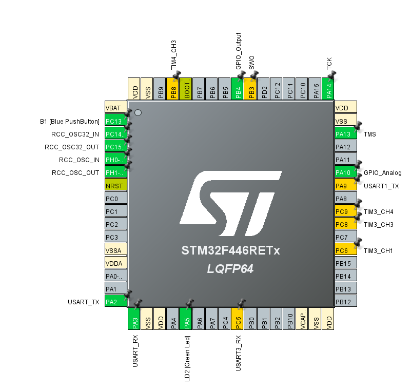

# STM32 Code as of Feb. 26, 2026

This project uses an STM32 microcontroller to control **two DC motors**, communicate over **Bluetooth (HC-05)**, and read a **metal detection circuit** using an **ADC input**. 

---

## Features

- **Dual motor control (DRV8833)** using PWM signals (2 pins per motor)
- **Bluetooth serial communication (HC-05, slave mode)** using USART TX/RX
- **Metal detection sensing** using an ADC input and a GPIO output

---

## Pin Assignments

### Motor Driver (DRV8833) — PWM Outputs
Two motors are controlled via PWM using two pins per motor (IN1/IN2 style control).

**Motor A (one motor)**
- `PC6` → PWM
- `PC8` → PWM

**Motor B (another motor)**
- `PC9` → PWM
- `PB8` → PWM

> These four pins generate PWM signals to drive a DRV8833 motor driver for bidirectional motor control.

---

### Bluetooth Module (HC-05) — USART
HC-05 is used as a **slave** Bluetooth module and is controlled over UART.

- `PA9`  → USART **TX** (STM32 → HC-05 RX)
- `PC5`  → USART **RX** (STM32 ← HC-05 TX)

---

### Metal Detection Circuit — ADC + GPIO
The metal detection circuit (see schematic image) interfaces to the STM32 with:

- `PA10` → **ADC input** (reads analog output of the detector circuit)
- `PB4`  → **GPIO output** (used as a control/enable/output drive line for the circuit, depending on firmware)

---

## Pin Configuration Diagram

---

## TO DO

- Create code for noise generation, object detection

---